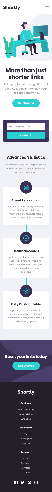

# **Shortly**

This project is a solution to the [Shortly URL shortening API Challenge challenge on Frontend Mentor](https://www.frontendmentor.io/challenges/url-shortening-api-landing-page-2ce3ob-G).

## Demo

[Demo](https://shortlyshorteningapi.netlify.app/)

## Technologies

-  [React](https://react.dev/) For building the user interface
-  [Vite](https://vitejs.dev/) For a fast development environment
-  [Tailwind CSS](https://tailwindcss.com/) for styling
-  [AOS.js](https://michalsnik.github.io/aos/) for smooth animations
-  [TinyURL API](https://tinyurl.com/) For shortening URLs
-  [Google Fonts](https://fonts.google.com/) for typography
-  [Jonsuh Hamburger](https://jonsuh.com/hamburgers/) For the hamburger menu animation

## Design




## Installation

Clone the repository

```shell
git clone https://github.com/Ilkenza/Shortly.git
```

Navigate to the project directory

```shell
cd Shortly
```

Set your API Token

Replace "YOUR_TOKEN" with your TinyURL API token in the appropriate file

```shell
API_TOKEN = "YOUR_TOKEN";
```

Install dependencies

```shell
npm install
```

Start the development server

```shell
npm run dev
```

## Author

- [Portfolio](https://ilijakorodic.netlify.app/)
- [My Links](https://linktr.ee/ilkenza)
